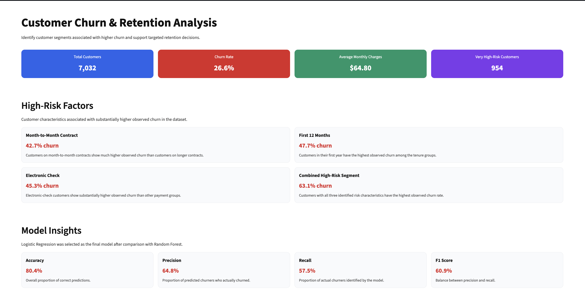

# Customer Churn & Retention Analysis

## Overview

A customer analytics project that analyzes churn patterns, identifies high-risk customer segments, and uses machine learning to support targeted retention decisions.

## Business Problem

Customer churn can reduce revenue and increase customer acquisition costs. Businesses cannot apply retention efforts equally to every customer, so identifying customer segments associated with higher churn can help prioritize retention efforts.

## Objectives

- Analyze customer churn patterns
- Identify characteristics associated with higher churn
- Build and compare classification models
- Segment customers using a transparent risk score
- Translate analytical findings into retention recommendations

## Dataset

The project uses the Telco Customer Churn dataset containing customer demographic, service, contract, payment, and billing information.

After cleaning:
- 7,032 customers
- 20 variables
- Target: Churn

## Tech Stack

- Python
- Pandas
- NumPy
- Matplotlib
- Seaborn
- Scikit-learn
- Streamlit

## Methodology

### 1. Data Cleaning

- Converted `TotalCharges` to numeric
- Handled missing values
- Removed customer identifier
- Encoded churn as a binary target

### 2. Exploratory Data Analysis

Analyzed churn across:

- Contract type
- Customer tenure
- Monthly charges
- Payment method

### 3. Machine Learning

Compared:

- Logistic Regression
- Random Forest

### 4. Risk Segmentation

Created a transparent risk score using:

- Tenure ≤ 12 months
- Month-to-month contract
- Electronic check payment

## Model Results

| Model | Accuracy | Precision | Recall | F1 Score |
|---|---:|---:|---:|---:|
| Logistic Regression | 80.38% | 64.76% | 57.49% | 60.91% |
| Random Forest | 78.46% | 62.28% | 48.13% | 54.30% |

Logistic Regression was selected as the final model based on its test performance and interpretability.

## Key Findings

- Month-to-month customers showed 42.7% observed churn.
- Customers in their first 12 months showed 47.7% observed churn.
- Electronic-check customers showed 45.3% observed churn.
- Customers with all three identified risk characteristics showed 63.1% observed churn.

## Dashboard



The Streamlit dashboard provides:

- Customer-level KPIs
- High-risk customer factors
- Model performance metrics
- Business-oriented retention insights

## Business Recommendations

- Focus early retention efforts on newer customers.
- Encourage suitable longer-term contracts for month-to-month customers.
- Investigate the payment experience of electronic-check customers.
- Prioritize customers showing multiple high-risk characteristics.
- Review pricing and service value for higher-charge customer segments.

## Project Structure

```text
customer-churn-retention-analysis/
├── churn_dataset.csv
├── churn_analysis.ipynb
├── app.py
├── README.md
└── .gitignore

The project combines exploratory analysis, machine learning, and transparent risk segmentation to identify customer groups associated with higher churn and support targeted retention decisions.